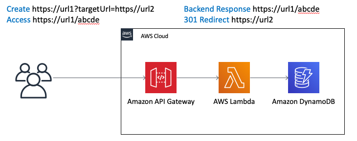
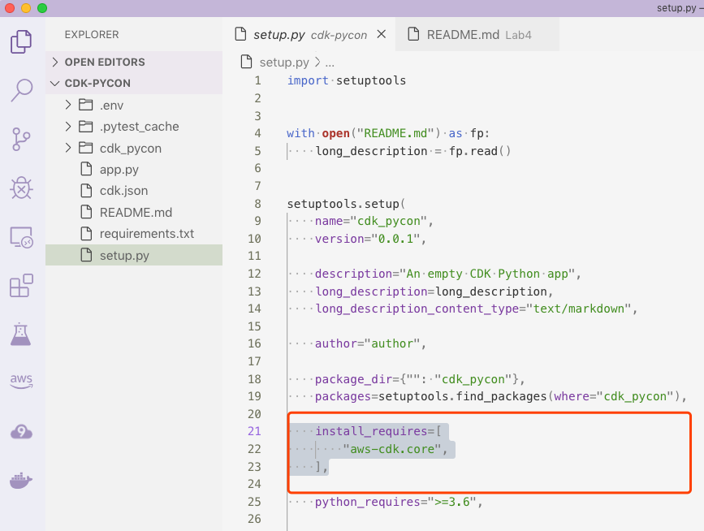
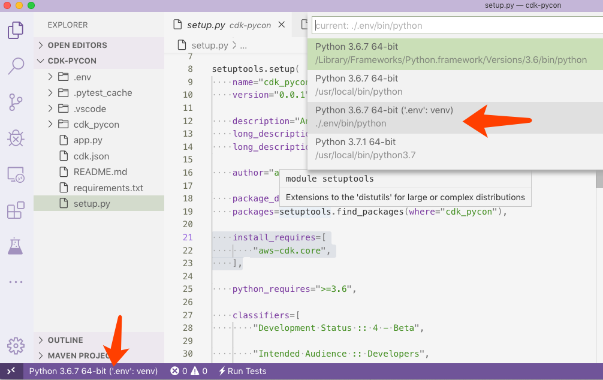
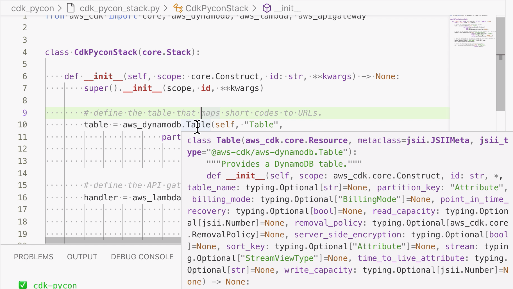
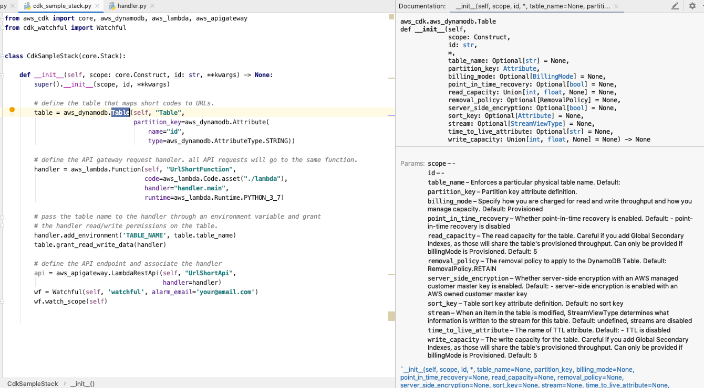
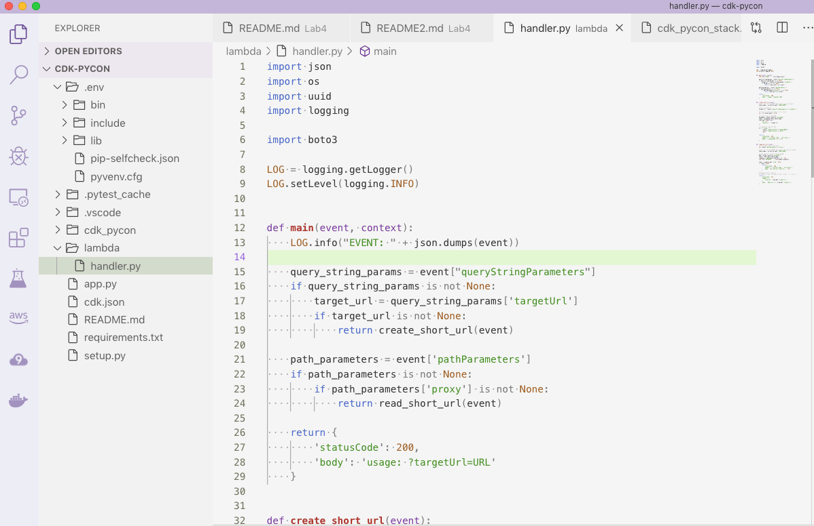

# Lab4 - Build a Serverless url-shortener application with AWS CDK in Python  

## Architecture
In this Lab, we will build a Serverless application to translate a long url to a shorten url as below architecture:

## Prepare 
* Install Node.js (>= 8.11.x) is a MUST  
https://nodejs.org/en/download/  
or 
http://nodejs.cn/download/  
Note:  
The AWS CDK is developed in TypeScript and transpiled to JavaScript. Bindings for Python make use of the AWS CDK engine running on Node.js.
* Install Python >= 3.6  
  If you code in Python with AWS CDK, Python >= 3.6 is needed.
* Install the AWS CDK
```
npm install -g aws-cdk
cdk --version
```
Updating Your Language Dependencies
```
pip install --upgrade aws-cdk.core
```
For more detail of installing AWS CDK, refer to https://docs.aws.amazon.com/cdk/latest/guide/getting_started.html
* Install AWS CLI (Command Line Interface)
```
pip install awscli
aws --version
```
For more detail of AWS CLI, please refer to https://aws.amazon.com/cli/
* Config your credentail and default region
Config your credential and default region for this lab. We can use AWS TOKYO region, as region name is ap-northeast-1, and please ask your admin to grant your IAM user's Access Key.
```
$ aws configure
AWS Access Key ID [****************Y7HQ]:
AWS Secret Access Key [****************rkr0]:
Default region name [ap-northeast-1]:
Default output format [text]:
```
More detail of aws configure, refer to: https://docs.aws.amazon.com/cli/latest/userguide/cli-chap-configure.html
## Init 
* Let's start with a new folder and init the project
```
mkdir cdk-pycon
cd cdk-pycon
cdk init app --language=python
```
* Open your IDE as you like:  
```
code .
OR
pycharm .
```
* Now you have init the cdk project, you can check the project structure and add dependencies in ./setup.py in IDE  

* Replace the install_requires with below packages in ./setup.py
```
    install_requires=[
        "aws-cdk.core",
        "aws-cdk.aws-dynamodb",
        "aws-cdk.aws-events",
        "aws-cdk.aws-events-targets",
        "aws-cdk.aws-lambda",
        "aws-cdk.aws-s3",
        "aws-cdk.aws-ec2",
        "aws-cdk.aws-ecs-patterns",
        "aws-cdk.aws-certificatemanager",
        "aws-cdk.aws-apigateway",
        "aws-cdk.aws-cloudwatch",
        "cdk-watchful",
        "boto3"
    ],
```
* Now open a Terminal in your IDE and create env and install the dependencies  
```
python3 -m venv .env
source .env/bin/activate
pip install -r requirements.txt
```
* You might need to change your interpreter in your IDE to the right environment.


Now you can start coding your infrastructure.   
## Coding 
* Open ./cdk_pycon/cdk_pycon_stack.py in your IDE, it should be like this:  
```
from aws_cdk import core


class CdkPyconStack(core.Stack):

    def __init__(self, scope: core.Construct, id: str, **kwargs) -> None:
        super().__init__(scope, id, **kwargs)

        # The code that defines your stack goes here
```
* Let's add a DynamoDB table into the code.  
Import aws_dynamodb, and add a Table, so the code become:
```
from aws_cdk import core, aws_dynamodb


class CdkPyconStack(core.Stack):

    def __init__(self, scope: core.Construct, id: str, **kwargs) -> None:
        super().__init__(scope, id, **kwargs)

        # The code that defines your stack goes here
        table = aws_dynamodb.Table(self, "Table",
                        partition_key=aws_dynamodb.Attribute(
                            name="id",
                            type=aws_dynamodb.AttributeType.STRING))
```
Check the AWS CDK document for detail parameter:
https://docs.aws.amazon.com/cdk/api/latest/python/index.html  
Or ALT + Mouse Over to view help if you are usging VSCode:

Or enable Quick Documentation if you are using PyCharm:

## Deploy 
* Deploy the stack in Terminal:
```
cdk bootstrap
cdk deploy
```
Enter "y" while deploying ask to confirm.  
You can observe via AWS Console to see the CloudFormation template is being deploy and after a minute, a DynamoDB table is created.


After one minute, after the deploy completed, you can check the AWS Console to see the DynamoDB table.
## Update 
* Add AWS Lambda function code  
Create a new sub-folder in the project and copy the lambda function code in this github repo to ./lambda/handler.py  

* Add Lambda and API Gateway to the stack.  
Open cdk_pycon_stack.py. Import aws_lambda and aws_apigateway and add the code into stack, so the code become:  
```
from aws_cdk import core, aws_dynamodb, aws_lambda, aws_apigateway


class CdkPyconStack(core.Stack):

    def __init__(self, scope: core.Construct, id: str, **kwargs) -> None:
        super().__init__(scope, id, **kwargs)

        # define the table that maps short codes to URLs.
        table = aws_dynamodb.Table(self, "Table",
                        partition_key=aws_dynamodb.Attribute(
                            name="id",
                            type=aws_dynamodb.AttributeType.STRING))

        # define the API gateway request handler. all API requests will go to the same function.
        handler = aws_lambda.Function(self, "UrlShortFunction",
                                      code=aws_lambda.Code.asset("./lambda"),
                                      handler="handler.main",
                                      runtime=aws_lambda.Runtime.PYTHON_3_7)

        # pass the table name to the handler through an environment variable and grant
        # the handler read/write permissions on the table.
        handler.add_environment('TABLE_NAME', table.table_name)
        table.grant_read_write_data(handler)

        # define the API endpoint and associate the handler
        api = aws_apigateway.LambdaRestApi(self, "UrlShortApi",
                                           handler=handler)
```
* To deploy the update stack in Terminal:
```
cdk deploy
```

* From the cdk deploy output, copy the url which is the Api Gateway entry point address https://xxxxxx.execute-api.ap-northeast-1.amazonaws.com/prod/  
* Test from a web browser with 3 steps:
1. Access the api.  
Backend return the usage querystring as help.

2. Add the querystring and target url with https://your_target_url after the api url.  
Backend return the created shorten url code

You can check the DynamoDB from console for the new created backend record.
3. Use the created url to access.  

The browser should redirect to your_target_url  

## Monitor
* Import Watchful module in stack code ./cdk_pycon/cdk_pycon_stack.py.  
```
from cdk_watchful import Watchful
```
* Add below code into stack  
```
wf = Watchful(self, 'watchful', alarm_email='your@email.com')
wf.watch_scope(self)
```
This will auto create a CloudWatch Dashboard to monitor all your resources and create SNS alarm to your mail address, in just two lines of code!  
Final stack code become like this:
[cdk_pycon_stack.py](./cdk_pycon/cdk_pycon_stack.py)
* Deploy the update stack in Terminal
```
cdk deploy
```
* From deploy output, click the watchfulDashboard link to access the CloudWatch Dashboard

You can find Metrics and Alarm have been created including DynamoDB, Lambda and API Gateway.  

## Custom Domain (optional)
You have completed to deploy a Serverless website backend, but you might not be satisified with the url, it is still too long. Refer to below steps to use your own domain name instead of the long domain name xxx.xxx.amazonaws.com and no stage path /prod/, such as only go.xyz.com
1. Create SSL certificate in Amazon Certificate Manager service
2. Create Custom Domain Name in Amazon API Gateway service
   And bind the api/stage you just created with this SSL certificate.
3. Create a CNAME record in Amazon Rout53 to redirect your go.xyz.com to the api you just created, or use any other DNS service to do that.  

For more code and demo, please refer to the Github repo https://github.com/aws-samples/aws-cdk-examples/tree/master/python/url-shortener  
Or youtube video session https://youtu.be/ZWCvNFUN-sU?t=336  
## Clean 
Delete whole stack in one command. It is very easy and clean.
```
cdk destroy
```
You can check the CloudFormation in AWS Console to confirm the delete completed or find the cause if there is fail.